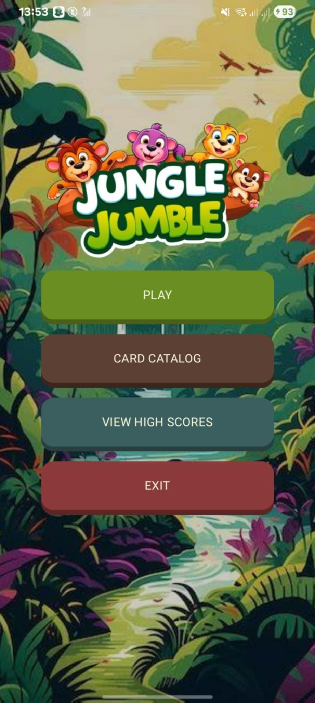
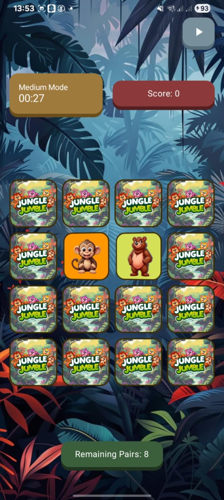
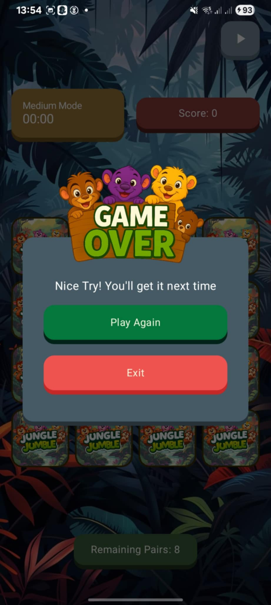

# JungleJumble - Memory Match Game

## 💡 About the Project

JungleJumble is a fun and colorful memory game for Android where players flip cards to match animal pairs. Each card shows a different animal with cool facts, making the game fun and educational. It has different difficulty levels, a scoring system, background music, sound effects, and playful 3D-style graphics.

  
  
  

### **⚙ Tools and Technologies Used**

1. **Kotlin** - Core programming language for the app.
2. **Jetpack Compose** - Modern toolkit for building native Android UIs.
3. **AndroidX Room** - For navigation, data storage, and lifecycle management.
4. **Material3** - For consistent and modern UI components.

## ❗❗ Disclaimer

This project was made as part of the final requirement for Application Development class at Pamantasan ng Lungsod ng Maynila. It is for learning purposes only and not meant for real-world or production use. This was a one-time submission and may not update or maintain this project regularly.

## 👥 Developers

<b>20242 BSCS 2-3

<b>LEADER: MANGUNI, John

-   CATACUTAN, Raphael
-   FRIAS, Railey
-   ROBANTE, Floyd
